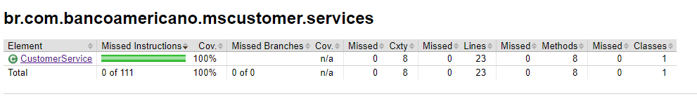
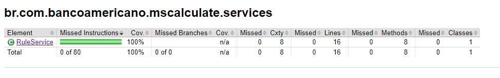
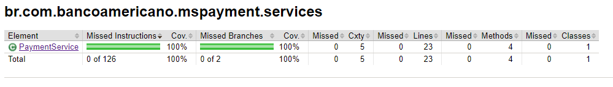

# PbAbrilDes3_LucasBernadino

## Visão geral
Projeto destinado ao Desafio 3 do Programa de Bolsas Compass, API com o tema de Banco Americano.

### Tecnologias

- Java 17
- Maven
- MYSQL
- Spring Boot
- Spring Data Jpa
- SpringDoc OpenAPI
- Jakarta Bean Validation
- ModelMapper
- Mockito
- Lombok
- Jacoco plugin

### Iniciar da aplicação

*Clone o Repositório*
```
https://github.com/luucasdinoo/luucasdinoo-PbAbrilDes3_LucasBernadino.git
```
*Acesse o Projeto*
```
cd luucasdinoo-PbAbrilDes3_LucasBernadino
```
*Instale as dependências do projeto*
```
mvn clean package 
```
*Inicie a aplicação*
```
mvn spring-boot:run
```

### Jacoco Reports




### cURLs

#### Customer

- POST - /v1/customers
```
curl --location 'http://localhost:8080/v1/customers' \
--header 'Content-Type: application/json' \
--header 'Accept: */*' \
--data-raw '{
  "base64Photo": "File",
  "name": "João Carlos Oliveira",
  "cpf": "123.456.789-09",
  "gender": "MALE",
  "birthdate": "15/10/2004",
  "email": "carlosolv@gmail.com"
}'
```
- GET - /v1/customers/:id
```
curl --location 'http://localhost:8080/v1/customers/1' \
--header 'Accept: */*'
```
- PUT - /v1/customers/:id
```
curl --location --request PUT 'http://localhost:8080/v1/customers/4' \
--header 'Content-Type: application/json' \
--data-raw '{
  "email": "carlosolvn@gmail.com",
  "name": "João Carlos Oliveira Neto"
}'
```
- DELETE - /v1/customers/:id
```
curl --location --request DELETE 'http://localhost:8080/v1/customers/<long>'
```

#### Rules

- POST - /v1/calculate
```
curl --location 'http://localhost:8080/v1/rules/calculate' \
--header 'Content-Type: application/json' \
--header 'Accept: */*' \
--data '{
  "categoryId": "1",
  "value": "1000"
}'
```
- POST - /v1/rules
```
curl --location 'localhost:8081/v1/rules' \
--header 'Content-Type: application/json' \
--header 'Accept: */*' \
--data '{
  "category": "Eletrônicos",
  "parity": 10
}'
```
- GET - /v1/rules
```
curl --location 'localhost:8081/v1/rules' \
--header 'Accept: application/json'
```
- PUT - /v1/rules/:id
```
curl --location --request PUT 'localhost:8081/v1/rules/7' \
--header 'Content-Type: application/json' \
--data '{
"category": "Brinquedos e Jogos",
"parity": "9"
}'
```
- DELETE - /v1/rules/:id
```
curl --location --request DELETE 'localhost:8081/v1/rules/<long>'
```

#### Payment
- POST - /v1/payments
```
curl --location 'localhost:8082/v1/payments' \
--header 'Content-Type: application/json' \
--header 'Accept: */*' \
--data '{
  "customerId": "1",
  "categoryId": "1",
  "total": "1000"
}'
```
- GET - /v1/payments/:paymentId
```
  curl --location 'localhost:8082/v1/payments/b8194a11-e6ae-4be8-999e-d517e9c7d936' \
  --header 'Accept: */*'
```
- GET - /v1/payments/user/:userId
```
curl --location 'localhost:8082/v1/payments/user/4' \
--header 'Accept: */*'
```


